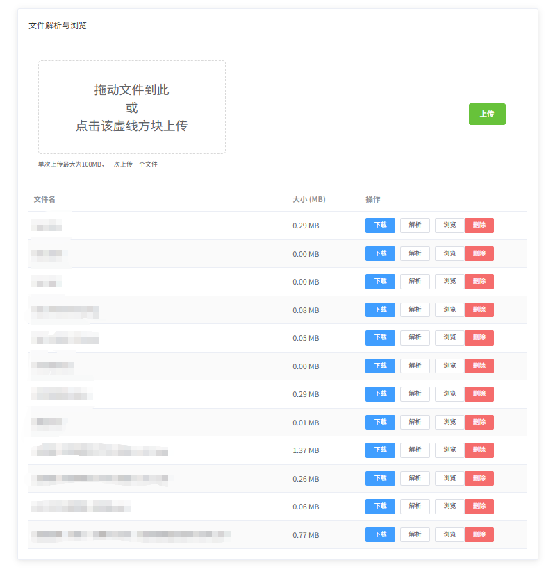
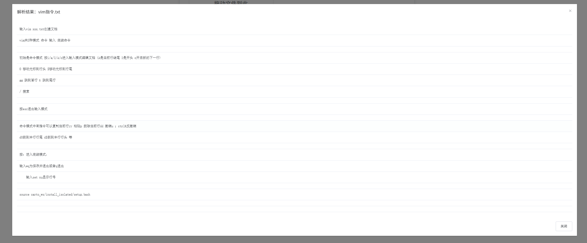

# 简介
学会了 `vue的基本语法` 和 `axios` 的使用就可以抄一些 `elementUI的官方代码` 自行设计前端界面了。  
后端接口调用的一个文档解析的项目，无代码。  
暂时还没用到 vuex ，后续学到再做补充。

前端代码地址：https://github.com/WHX258/MyFrontendProjects  
项目运行效果：

文档解析前端展示界面：


# 项目建立
1. 使用 `vue-cli` 创建一个新的 `vue` 项目。（组件化开发`hellocli`有详细介绍）
```bash
vue create FileHandler
```
2. 安装 `axios` 和 `elementUI`。（组件化开发`hellocli`和`Axios`有详细介绍）
```bash
npm install axios element-ui
```
3. 在 `main.js` 中引入 `elementUI`，`Axios`，设置后端接口的 `baseURL`并挂载。
```javascript
// import Vue ...
// 。。。
import ElementUI from 'element-ui';
import 'element-ui/lib/theme-chalk/index.css';
import axios from "axios";

Vue.config.productionTip = false

axios.defaults.baseURL = 'http://localhost:8081';
Vue.prototype.$http = axios;

Vue.use(ElementUI);
// VUE挂载
// ...
```

# 基本页面的设计
全部页面可以放在一张element卡片上，上面是文件上传组件（使用`element的上传器`），下面是文件列表组件（使用`element的表格`），
列表左侧显示文件名，右侧有删除和解析按钮，解析后弹窗显示解析结果（使用`element的弹窗`显示功能）。  

在`App.vue`中主要是设计`el-card`的布局，包括了引入组件`FileUpload`，`FileList`，`ParseDialog`，还有调用后端接口。

`Card` 由 `header` `body` 和 `footer`组成。 `header` 和 `footer` 是可选的，其内容取决于一个具名的 `slot`(插槽)。

`App.vue`
```vue
<template>
  <div style="max-width:1000px; margin:20px auto;">
    <el-card>
      <!--slot插槽-->
      <div slot="header">
        <span>文件解析与浏览</span>
      </div>
      <!--
      加载子组件file-upload，
      监听子组件file-upload中触发的uploaded事件，当事件触发时调用reloadList方法重新加载文件列表
      -->
      <file-upload @uploaded="reloadList"></file-upload>
      <!--
      加载子组件file-list，并监听delete-file、parse-file、reload事件
      通过 :files 传递给子组件files
      -->
      <file-list
          :files="files"
          @delete-file="handleDelete"
          @parse-file="handleParse"
          @reload="reloadList">
      </file-list>
      <!--
      加载子组件parse-dialog，进行 文件名和解析结果 的双向绑定
      -->
      <parse-dialog
          v-model="parseDialogVisible"
          :file-name="parseFileName"
          :lines="parseLines">
      </parse-dialog>
    </el-card>
  </div>
</template>

<script>
  import FileUpload from './components/FileUpload.vue';
  import FileList from './components/FileList.vue';
  import ParseDialog from './components/ParseDialog.vue';

  export default {
    name: 'App',
    components: { FileUpload, FileList, ParseDialog },

    data() {
      return {
        // 文件列表，初始为空，后续通过reloadList函数加载后端数据
        files: [],
        parseDialogVisible: false,
        parseFileName: '',
        parseLines: []
      };
    },
    // created函数在组件实例被创建后立即调用（网页打开或刷新），即，加载文件列表
    created() {
      this.reloadList();
    },
    methods: {
      // 异步
      async reloadList() {
        try {
          const res = await this.$http.get('/files/list');
          this.files = res.data;
        } catch (err) {
          console.error(err);
          // this.$message是vue的弹窗消息，示例：https://blog.csdn.net/PlasticsShaT/article/details/110632191
          this.$message.error('无法加载文件列表');
          this.files = [];
        }
      },
      // fileName从子组件file-list传递过来
      async handleDelete(fileName) {
        try {
          // encodeURIComponent对URI的特殊字符编码，确保文件名中的特殊字符不会导致请求错误
          await this.$http.delete('/files/delete/' + encodeURIComponent(fileName));
          this.$message.success('删除成功');
          this.reloadList();
        } catch (err) {
          console.error(err);
          this.$message.error('删除失败');
        }
      },
      async handleParse(file) {
        try {
          // 下载为 blob，再提交到解析接口，与后端保持兼容
          const url = file.downloadUri || ('/files/download/' + encodeURIComponent(file.fileName));
          const resp = await this.$http.get(url, { responseType: 'blob' });
          const blob = resp.data;
          const f = new File([blob], file.fileName, { type: blob.type || 'application/octet-stream' });
          const fd = new FormData();
          fd.append('file', f);
          const parseResp = await this.$http.post('/files/parse', fd);
          const data = parseResp.data;

          if (data.error) {
            this.$message.error(data.error);
            return;
          }
          // 后端解析接口会返回paragraphs字段，这里ide标黄没事。
          const paragraphs = Array.isArray(data.paragraphs) ? data.paragraphs : [];
          const lines = [];
          paragraphs.forEach(p => {
            const txt = (typeof p === 'string') ? p : JSON.stringify(p);
            txt.split(/\r?\n/).forEach(l => lines.push(l));
          });
          this.parseFileName = file.fileName;
          this.parseLines = lines;
          this.parseDialogVisible = true;
        } catch (err) {
          console.error(err);
          this.$message.error('解析失败');
        }
      }
    }
  };
</script>
```


# 文件上传组件

使用了`el-upload`，父组件使用`@uploaded`监听`this.$emit('uploaded');`，触发重新加载文件列表。  
`:limit`属性限制一次只能上传一个文件，`:auto-upload`设置为`false`，禁止自动上传，改为点击上传按钮时才上传。
`FileUpload.vue`
```vue
<template>
  <div style="display:flex; padding:18px; border:1px; border-radius:8px; align-items:center; justify-content:center; flex-wrap:wrap; gap:16px;">
    <el-upload
        ref="uploader"
        drag
        :auto-upload="false"
        :limit="1"
        :on-change="handleChange"
        multiple
        style="flex:1; min-width:100px; width:100%;">

      <div style="height:100%; display:flex; align-items:center; justify-content:center;">
        <font size="5">
          拖动文件到此 <br>或 <br>点击该虚线方块上传
        </font>
      </div>

      <template #tip>
        <div class="el-upload__tip">
          单次上传最大为100MB，一次上传一个文件

        </div>
      </template>
    </el-upload>

    <el-button type="success" :loading="uploading" @click="submitUpload">上传</el-button>
    <span style="margin-left:8px; color:#666;">{{status}}</span>

  </div>
</template>

<script>

export default {
  // 命名为FileUpload, 在App.vue的template中引入时可以使用<file-upload>标签。
  name: 'FileUpload',
  data() {
    return {
      file: null,
      uploading: false,
      status: '' // 标记上传状态，提示用户当前状态，如“上传中...”、“上传成功”、“上传失败”等。
    };
  },
  methods: {
    handleChange(file) {
      this.file = file.raw || file;
    },
    async submitUpload() {
      if (!this.file) {
        this.status = '请先选择文件';
        return;
      }
      this.uploading = true;
      this.status = '上传中...';
      try {
        const fd = new FormData();
        fd.append('file', this.file);
        await this.$http.post('/files/upload', fd);

        this.$message.success('上传成功');
        this.$refs.uploader.clearFiles();
        this.file = null;
        this.$emit('uploaded');
        this.status = '上传成功';
        setTimeout(() => this.status = '', 1500);
      } catch (err) {
        console.error(err);
        this.$message.error('上传失败');
        this.status = '上传失败';
      } finally {
        this.uploading = false;
      }
    }
  }
};
</script>
```

# 文件列表组件
使用了`el-table`，监听删除和解析按钮的点击事件，触发父组件的delete-file和parse-file事件，通知父组件进行删除或解析操作。  
`el-table`组件会自动遍历传入的`files`数组，并为每个文件创建一行，不需要手动使用`v-for`来循环渲染表格行。

`FileList.vue`
```vue
<template>
  <div>
    <!-- 有files且文件数组长度大于零才渲染-->
    <el-table v-if="files && files.length" :data="files" stripe style="width:100%">
      <el-table-column prop="fileName" label="文件名"></el-table-column>
      <el-table-column label="大小 (MB)" width="140">
        <template slot-scope="scope">{{ formatMB(scope.row.size) }}</template>
      </el-table-column>
      <el-table-column label="操作" width="320">
<!--        scope意思是当前行的数据对象，scope.row就是当前行的数据对象，scope.column是当前列的数据对象，scope.$index是当前行的索引。-->
        <template slot-scope="scope">
          <el-button :href="downloadUri(scope.row)" type="primary" size="mini" target="_blank">下载</el-button>
          <el-button size="mini" @click="$emit('parse-file', scope.row)">解析</el-button>
          <el-button size="mini" @click="viewFile(scope.row)">浏览</el-button>
          <el-popconfirm
              title="确认删除？"
              confirm-button-text="删除"
              cancel-button-text="取消"
              @confirm="$emit('delete-file', scope.row.fileName)">
            <el-button slot="reference" type="danger" size="mini">删除</el-button>
          </el-popconfirm>
        </template>
      </el-table-column>
    </el-table>

    <div v-else style="text-align:center; padding:18px; color:#999">暂无文件</div>
  </div>
</template>

<script>

export default {
  name: 'FileList',
  props: ['files'],
  methods: {
    // 显示MB，默认是字节
    formatMB(bytes) {
      if (typeof bytes !== 'number' || bytes <= 0) return '0.00 MB';
      return (bytes / (1024 * 1024)).toFixed(2) + ' MB';
    },
    downloadUri(row) {
      return row.downloadUri || ('/files/download/' + encodeURIComponent(row.fileName));
    },
    viewFile(row) {
      const url = 'http://localhost:8081/files/view/' + encodeURIComponent(row.fileName);
      window.open(url, '_blank');
    }
  }
};
</script>
```

# 解析结果弹窗组件
使用了`el-dialog`，通过visible属性控制弹窗的显示和隐藏，通过`file-name`和`lines`属性显示解析结果。    
`ParseDialog.vue`
```vue
<template>
  <el-dialog :visible.sync="localVisible" :title="'解析结果：' + (fileName || '')" width="95%">
    <!--无结果-->
    <div v-if="!lines || lines.length===0">
      <p style="color:#888">未提取到任何文本</p>
    </div>
    <el-table v-else :data="lines.map((t,i)=>({i:i+1,text:t}))" style="width:100%">
      <el-table-column prop="text">
        <template slot-scope="scope">
          <pre style="white-space:pre-wrap; margin:0;">{{ scope.row.text }}</pre>
        </template>
      </el-table-column>
    </el-table>
    <span slot="footer" class="dialog-footer">
      <el-button @click="localVisible = false">关闭</el-button>
    </span>
  </el-dialog>
</template>

<script>
  export default {
    name: 'ParseDialog',
    model: { prop: 'visible', event: 'update:visible' },
    props: {
      visible: Boolean,
      fileName: String,
      lines: { type: Array, default: () => [] }
    },
    data() {
      return { localVisible: this.visible };
    },
// Vue 的 侦听器，把父组件传下来的 parseDialogVisible 和组件内部的 localVisible 状态做同步，实现“属性下传、事件上报”的模式：
// 第一行，当父组件改变 visible（比如打开/关闭对话框）时，把新值写入内部的 localVisible，以驱动视图。
// 第二行，localVisible 变为 false（例如用户点击关闭）时，向父组件发出 update:visible 事件，通知父组件把 visible 设为 false（配合v-model）。注意这里只在变为 false 时发出，没有在变为 true 时回传。
    watch: {
      visible(v) { this.localVisible = v; },
      localVisible(v) { if (!v) this.$emit('update:visible', false); }
    }
  };
</script>
```