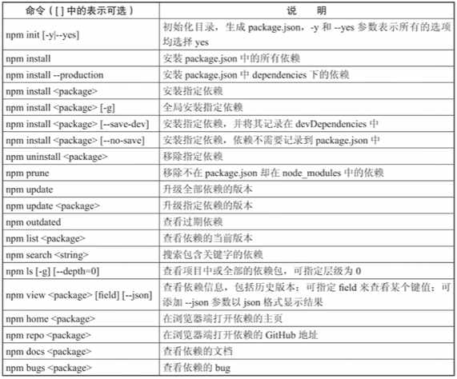

VUE组件化开发

# NPM使用
npm是`nodeJS`的包管理工具，类似于后端开发时使用的`Maven`。
通过npm可以方便地安装、更新和管理项目所需的各种依赖包。下载比较方便，直接官网下载安装包即可。不再赘述。  
链接：https://nodejs.org/zh-cn/

常见命令：  


# VUE CLI使用
VUE CLI是Vue官方提供的**脚手架**，用于**快速搭建Vue项目**。
通过CLI可以生成一个标准化的项目结构，集成了常用的开发工具和配置，并且修改代码可以`实时的看到页面更新`，极大地提高了开发效率。
打开命令行，执行以下命令即可安装Vue CLI：
```bash
npm install -g @vue/cli
```
这里-g表示全局安装，可以在任何目录下使用vue命令。  
进入指定目录，执行以下命令创建一个新的Vue项目：
```bash
vue create hellocli
```
按照提示选择配置选项，CLI会自动生成项目结构并安装依赖包。  
初学建议选择`Manually select features`，取消`Linter`功能，用`package.json`管理依赖(类似于`pom.xml`)。

# 组件化开发
Vue采用组件化开发模式，将页面拆分为多个独立的组件，每个组件封装了自己的模板、逻辑和样式。
这样可以提高代码的复用性和可维护性。
创建好可以看到项目结构如下：
```
hellocli/
├── node_modules/        # 依赖包目录
├── public/              # 静态资源目录
├── src/                 # 源代码目录
│   ├── assets/         # 静态资源
│   ├── components/     # 组件目录
│   ├── App.vue         # 根组件
│   └── main.js         # 入口文件
└── package.json        # 项目配置文件（项目的基本信息如名称、版本、是否私有化、依赖包等）
```
## 快速启动
打开命令行，进入项目目录，执行以下命令启动开发服务器：
```bash
npm run serve
```
服务器启动后，可以在浏览器中访问`http://localhost:8080`查看项目效果。  

## 各文件说明
### `main.js`：项目的入口文件
模块化设计（import导入模块，**不用再使用script**标签引入）。

### `App.vue`：根组件   
组件是Vue应用的基本组成部分，每个组件都有自己的`模板、逻辑和样式`。组件可以`嵌套使用`、`复用`，从而构建复杂的用户界面。  
组件后缀名为`.vue`，每个`.vue`文件通常包含三个部分：
   - 模板Template：定义组件的HTML结构，使用`<template>`标签包裹，可以包括其他组件，
   例如`<HelloWorld msg="Welcome to Your Vue.js App"/>`。
   - 脚本Script：定义组件的逻辑和数据。
   - 样式Style：定义组件的样式。  

### `components/`：存放各个组件的目录。可以在该目录下创建多个`.vue`文件，每个文件对应一个组件。
如何使用其他组件？  
有三步，`导入、注册、使用`。
1. 在`script`部分导入组件
2. 在`components`选项中注册组件
3. 在`template`部分使用组件标签。
   例如：
```vue
<template>
   <HelloWorld msg="Welcome to Your Vue.js App"/>
</template>

<script>
import HelloWorld from './components/HelloWorld.vue'

export default {
  name: 'App',
  components: {
    HelloWorld
  }
}
</script>
```

