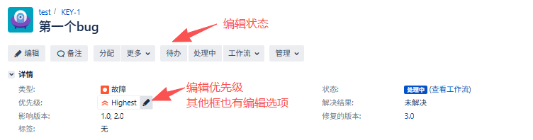

# 简介

`jira` 是跨平台的项目与事务跟踪工具，被广泛应用于**缺陷跟踪**需求收集、流程审批、任务跟踪等工作领域，
配置灵活、功能全面、部署简单、扩展丰富。
它是一个专业的问题跟踪管理的软件。  
这里的"问题"含义比较广，包括 `Bug`,`Task`,`Enhancement`,`Improvement` 等等跟软件开发相关的名词。  
跟踪管理：对问题的整个生命周期进行记录和管理。

## bug的生命周期
指从bug被发现到最终关闭的整个过程，如图：
```
                          + -------    重新激活  ---------------+
                          ↓                                    |否
发现 --> 确认 --> 提交 --> 指派 --> 研发确认 -是-> 研发解决 -是-> 验证 -->  关闭
                                     ↓否            ↓否       
                      重复bug/不是缺陷/无法复现   不予解决、延期 
                      
```
对测试人员来说，主要涉及：
```
发现 --> 记录 --> 验证 --> 关闭
                      --> 重新激活
```
对开发人员来说，主要涉及：
```
指派 --> 研发确认 --> 研发解决
                 --> 不予解决、延期
```

## bug的不同状态

-----比较顺利的流程-----
* 新建(new)
* 指派(assigned)
* 修复(resolved)
* 验证(verified)
* 关闭(close)  

-----可能出现的其他状态-----
* 重复(duplicated)
* 无效(invalid)
* 无法复现(unreproduced)
* 不予解决(wontfix)
* 延期(delayed)
* 重新激活(reopened)

`更改状态时都要求添加备注（原因），备注显示在bug历史中，方便后续查询。`


## bug的优先级和严重级别

缺陷的严重级别 (`bug本身`的严重程度):
1. 致命错误 (blocker):P1级别，一般是开发方面没有自测;
2. 严重错误 (critical):P2级别，一些**偶现**的致命错误;
3. 一般错误 (major):P3级别，工作中最常见的一种bug;
4. 细微错误 (minor):P4级别，比较少，很多公司会统一用major来代替;
5. 改进建议 (enhancement):**建议**和优化的**增强性bug**。很多时候，提出来本次迭代不会修复，会作为需求放到下次迭代修复。

缺陷的优先级 (`修复bug`的优先级):
1. 高优先级
2. 中优先级
3. 低优先级

一般越严重的bug，修复的优先级就越高;  
但是也有特殊情况，比如**bug比较严重，但是修复需要项目推倒重来，可能优先级也不会很高。**  
因此需要综合评估，两个字段都需要设置。


## bug类型

1. **代码**错误 (functional): 这种类型的bug`一般是最多的`，也是最重要和基础的，测试要**优先发现**的一类的bug
2. **界面**优化 (UI): 美观性的bug
3. 设计缺陷 (Enhancement): **需求不合理**，需要改进和优化的设计
4. 配置相关 (configuration): 涉及到一些**配置的命令**或者设计的bug
5. 性能问题 (Performance): **性能问题**，比如并发、吞吐、响应时间等，问题可大可小
6. 安全问题 (Secure): 安全的隐患或者漏洞等
7. 兼容性问题 (Integration): 兼容性的bug

一般情况，`代码错误、性能问题`都比较重要。  
**举例：**  
假如说，测试出的报告里，代码错误少，界面优化的bug比较多，
可能说明测试的质量不太好，或者说测试的范围不太全面，或者说测试的能力不太强...  
假如说，性能问题比较多，代码错误又比较少，可能说明项目开始设计的就有问题，项目不稳定。


## bug示例
假如说测试过程中发现前端浏览器F12在登陆界面看到了用户的密码，这是一个安全问题。可以记录信息如下：  
所属项目: ...  
功能模块: `登录模块`  
缺陷状态: `new`  
缺陷类型: `安全性bug`  
严重程度: `critical`  
优先级: ? (需要与开发人员商议成本等问题)  
指派给: xxx  
测试环境: win10，Firefox  

bug标题: 登录过程中密码传输显示为明文，不安全 (`标题需用最简洁的语言描述问题`)  
步骤描述 (`尽可能详细，可以包含一些截图、日志附件`):  
1、打开...的网址  
2、输入用户名和密码，点击登录  
3、F12抓包并捕获登录的信息，查看  
实际结果: 登录的密码被抓取后，显示为明文。  
预期结果: 密码这种敏感信息在传输过程中应该加密处理，保证安全性。  


# jira基本概念

## 安装
参考：  
https://blog.csdn.net/qq_59344199/article/details/128074434


## project 项目的概念

project 是一组问题单(Issue)的集合  
每一个issue属于一个项目。每个项目需要有一个名称和关键字。  
项目的关键字会成为项目问题单前缀。

`操作：` 
```  
点击左上角 `项目` -> `创建项目`，选择一个模板，输入项目名称和关键字，就可以创建一个项目了。  

这里项目有不同的模板，不同模板包含了 `不同种类的问题` 还有 `不一样的工作流` ，比如：
- Scrum开发项目：包含了 `Epic`,`Story`,`Task`, `Sub-task`, `Bug`，工作流是 `To Do->In Progress->Done`
- Kanban开发项目：问题种类 `同上` ，工作流是 `backlog->selected for development->in progress->done`
- 基本开发方法：包含了`Epic`, `New Feature`, `Improvement`, `Task`, `Sub-task`, `Bug`，工作流是 `To Do->In Progress->In Review->Done`
```

## issue 问题单的概念

跟踪issue，可以是bug，功能请求或者`任何其他想要跟踪的的任务`。  

issue的类型主要包括:  
* `Bug` - 故障，功能失效:Bug可由任何发现之人录入。--测试主要关注
* `Improvement` - 既有功能增强
* `New Feature` - 新功能
* `Task` - 用来管理开发/测试的基准与进度。Task分配到人，以便进行管理团队成员每日都应该更新自己的Task使用时间和进度。SM，PM及TL可以查看状态信息，以便在第二天站会的时候能有效的解决问题。
* `Sub-task`-子任务，进行任务分解

`操作：` 
```
如果是新建的项目，那第一眼看过去就有一个 创建问题的按钮 ，点击它就可以创建一个issue了。
issue的表单表单和上面描述的bug示例表单非常类似，包含了标题、描述、优先级、指派人等字段。
如果已经存在过问题了，那问题列表最下面有个 `创建问题`
```

## version 版本的概念

`一个issue需要关联到一个项目版本(例如1.0,1.2,2.0...)`   

Issues 跟版本有关的字段:
- 影响版本(`Affects Version`): 受问题单影响的版本
- 修复版本(`Fix Version`): 在哪一个版本中被修复。比如Bug的影响版本号是1.1和1.2，但是可能会在版本2.0中才被修复。没有修复版本号的问题单会被归类为未规划(`Unscheduled`)  

版本有三种状态:
- 发布(`Released`)
- 未发布(`Unreleased`)
- 归档(`Archived`)  
版本会有一个发布日期，并且`如果在发布日期之后还没有按时发布`，这个状态会自动变为过期状态(`overdue`)。

`操作：`
```
如图，在issue详情中，可以直接编辑影响版本和修复版本字段，选择对应的版本号即可。
```


## workflow 工作流的概念

workflow 由一系列的状态(statuses)和变迁(transitions)构成。
一个问题单在其生命周期中会经过这些状态和变迁，不同项目模板会有不同的内置工作流，也可以自己定义工作流。

常见工作流：`To Do->In Progress->In Review->Done`
- `To Do`: 新开的bug
- `In Progress`: 开发正在处理bug
- `In Review`: 开发bug改完了，等测试验证
- `Done`: 测完了关闭，原则上，解决人不能够直接close指定给自己的Issue，必须由指定给自己的reporter来验证。


## status状态的概念

其实刚才提到的`To Do`等就是状态，是工作流的一个组成部分。除了刚才提到了几个，还有一些常见的状态比如：
* Under Review(在审核): 测试人员在验证
* Resolved(已解决): 开发修过了，等测试
* Reopened(重新打开): 验证不通过的Issue，修改状态为reopened，表示该问题仍未解决，可以指回给解决人继续解决
* Pending(搁置): 无法处理，暂时搁置
* Feedback(反馈): 解决人对问题有疑问的问题，修改状态为Feedback，并指回给reporter
* Cancelled(取消): 问题单被取消了，但是也可以被再次打开
* Approved(审核通过)：任务审核通过了
* Rejected(拒绝): 开发觉得不是bug，被拒绝了

`变更状态操作：`
```
在项目的issue详情中，可以直接编辑每一个issue的状态（就在标题下面），选择对应的状态即可。
```

`新增状态操作：`
```
点击右上角 `设置` -> `Issues` -> `状态` -> `添加状态`
添加状态以后点击 `工作流` -> `编辑` -> `添加状态`，可以把新增的状态添加到工作流中
```

## resolution 解决结果的概念

issue解决结果会有以下几种: 
* Fixed 修复
* Unresolved 未修复
* Won't Fix 不用修复，例如这个问题所描述的现象已不再有影响了
* Duplicate 同其它已经存在的问题重复了，把相关的单子链接起来
* Incomplete 没有足够的信息继续完成这个问题
* Cannot Reproduce 不能重现，如果以后有更多信息可以继续可以重新打开
* Won't Do 不做，类似于不用修复，试用于软件项目的默认状态。

resolution也可以自定义，（设置，issue，解决方式）并关联到workflow里，不建议太多状态，不方便跟踪。

## 人员
在`issue`详情界面的右侧，有一个`人员`的模块，包含了`reporter`(报告人)，`assignee`(指派人)，悬停在上面也有编辑按钮，可以修改人员信息。


