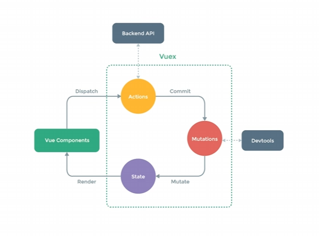

# 简介
vuex提供了`全局的状态管理器`，用于`组件之间的状态共享`。它采用`集中式存储管理`所有组件的状态。  
一般情况其实用不到，复杂的项目才需要使用vuex来管理状态，简单的项目可以直接使用组件之间的props和事件来进行通信。

## 状态管理
每一个vuex的核心是`store`。store状态变化时，与之绑定的视图就会变化。  
store中的状态不允许被直接修改，改变store中的状态的唯一途径是显式地提交(commit) mutation。
它包含了`state`、`getters`、`mutations`、`actions`和`modules`等属性。


## state
state是一个对象，`包含了应用的数据`。外部组件可以通过`this.$store.state.xxx`来访问state中的数据。  
于是每个组件都可以访问到store中的数据了。
## mutations
mutations包含了多个`用于更改state中的数据的方法`。
外部组件通过`this.$store.commit('mutationName')`来调用mutations中的方法，提交mutation，更新state，更新视图。
## getters
getters对state中的数据进行加工处理。
外部组件通过`this.$store.getters.xxx`来访问getters中的属性。
## actions
actions包含了多个方法，这些方法用于处理异步操作。actions中的方法可以调用mutations来更改state中的数据。
外部组件通过`this.$store.dispatch('actionName')`来调用actions中的方法，触发action，更新state，更新视图。


# 安装
vue2对应vuex3，vue3对应vuex4。
```bash
npm install vuex@3
```

# 使用

## 获取 state 和 实现 mutations
1. 建立`store`文件夹用于管理状态，建立`index.js`，`use(VueX)`，然后创建`store实例`，`export store`。

```js
import Vue from 'vue'
import Vuex from 'vuex'

Vue.use(Vuex)

const store = new Vuex.Store({
  state: {
    count: 0
  },
  getters: {
  },
  mutations: {
      increment(state) {
        state.count++
      }
  },
  actions: {
  },
  modules: {
  }
})
export default store

```

2. 在`main.js`中引入store，并挂载到vue实例上。
`main.js`
```js
import Vue from 'vue'
import App from './App.vue'
import store from './store'

Vue.config.productionTip = false

new Vue({
  // 在vue上挂store
  store: store,
  render: h => h(App)
}).$mount('#app')
```

3. 在组件中使用store中的数据和方法。

这有两种方式：
可以直接在`div`中使用`{{this.$store.state.count}}`来访问state中的数据，
或 使用`计算属性`来访问state中的数据，这样就不需要每次都通过`this.$store.state`来访问了。
计算属性部分也可以进一步使用`mapState`简化，快速将store.state的属性 映射到 组件的计算属性中。

```vue
<template>
  <div class="hello">
    <h1>{{ this.$store.state.count }}</h1>
<!--    或者更简洁只写count，用计算属性-->
    <h1>{{ count }}</h1>
    <button @click="add">+1</button>
  </div>
</template>

<script>
import {mapState} from "vuex";

export default {
  name: 'HelloWorld',
  // 计算属性: 根据state计算新数据
  // computed: {
  // 这里count()方法的返回值就是计算属性count的值了，组件中就可以直接使用count来访问这个值了。
  // 方法名对应计算属性的名字。
  //   count() {
  //     return this.$store.state.count
  //   }
  // },
  
  // mapState： 将store中的state映射到组件的计算属性中
  // computed:mapState({
  //   count: state => state.count // 箭头函数
  // //   这里count是组件中的计算属性的名字
  // }),
  
  //   或者更简单只写 'count'，如
  computed: mapState(['count']),
  
  methods: {
    add() {
      this.$store.commit('increment')
    }
  }
}
</script>
```

## getter
